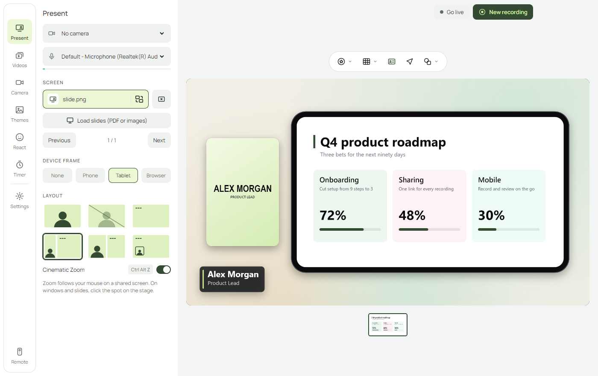

<p align="center">
  
</p>

<p align="center">
  <a href="https://onstage-v1.vercel.app/"><b>Website</b></a>
  &nbsp;·&nbsp;
  <a href="https://github.com/abhinavakhil/onstage/releases/latest/download/Onstage-Setup.exe"><b>Download for Windows</b></a>
</p>

Your camera, screen and brand on one stage. Use it as your camera in Zoom, Meet or Teams, or record
and share. No editing.

<p align="center">
  
</p>

## What it does

- **Six layouts** you can switch mid-sentence: camera, screen, side by side, split, picture in picture, camera-off screen
- **Cinematic Zoom** that follows your mouse on a shared screen
- **Virtual backgrounds**, skin smoothing and studio light, all processed on your computer
- **Your brand**: backgrounds, logo, name tag, device frames
- **Reactions, GIFs and an on-stage timer**
- **Onstage Camera**: pick it as your camera in Zoom, Meet or Teams and the call sees your stage
- **Go live**: a clean window of your stage to share in Zoom, Meet or Teams
- **Video library** with trim and export at 1080p, 720p or 480p
- **Floating remote** and global shortcuts (`Ctrl` `Alt` `1–6`, `Z`, `X`, `R`)

## Install

Download [Onstage-Setup.exe](https://github.com/abhinavakhil/onstage/releases/latest/download/Onstage-Setup.exe)
and run it. The installer is not code-signed yet, so Windows shows a "Windows protected your PC" notice:
choose **More info**, then **Run anyway**. It asks for administrator rights so it can add the Onstage Camera.

## Run from source

Needs [Node.js](https://nodejs.org) 20 or newer.

```
npm install
npm start
```

Running from source, the camera driver is not registered. To add it, run the two commands in
[native/vcam/README.md](native/vcam/README.md) from an administrator prompt.

Build the installer with `npm run dist:win` (or `npm run dist:mac` on a Mac). It lands in `dist/`.

## Not in this version

- No direct iPhone or iPad capture, and no Stream Deck plugin (the shortcuts work with its Hotkey action)
- macOS builds are untested

## Project layout

| Path | What it is |
| --- | --- |
| `main.js`, `preload.js` | Windows, permissions, screen sources, video library, global shortcuts |
| `renderer/` | The studio UI, the compositor and recorder (`app.js`), the floating remote |
| `vcam.js`, `native/vcam/` | Onstage Camera: the feed, and the open-source driver it feeds (UnityCapture, MIT) |
| `renderer/vendor/` | pdf.js, the MediaPipe person-segmentation model, the Manrope font |
| `landing/` | The website |
